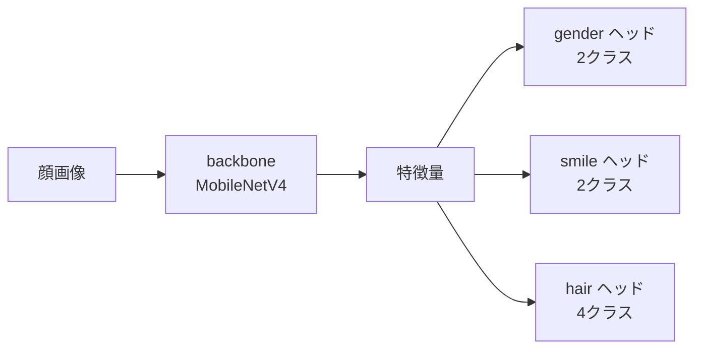

# CelebA データでのマルチタスク分類

- サンプルデータとして CelebA データセットを使用する場合の手順を記載します
- [「Docker での環境構築」](/docker/experiment/README.md) が完了してから実施してください
- 学習環境の構築が正常に行われているかを確認するための手順なので、この手順はスキップしても問題ありません

## CelebA データセットの用意

CelebA データセットは、顔画像とそれに対応する40種類の属性ラベルを含む大規模なデータセットです。

準備する方法はいくつかあります。
以下のいずれか分かりやすい方法で、必要なファイル群のダウンロードを行ってください。3つ方法を掲載しますが、どれか一つのみ実施すれば問題ありません。

- Web ページからダウンロード: https://ftp.mi.fu-berlin.de/pub/cmb-data/celeba/
- Web ページからダウンロード: https://mmlab.ie.cuhk.edu.hk/projects/CelebA.html
- curl コマンドでダウンロード (以下を参照)

    ```bash
    cd data
    mkdir celeba
    cd celeba

    curl -OL https://ftp.mi.fu-berlin.de/pub/cmb-data/celeba/README.md
    curl -OL https://ftp.mi.fu-berlin.de/pub/cmb-data/celeba/identity_CelebA.txt
    curl -OL https://ftp.mi.fu-berlin.de/pub/cmb-data/celeba/img_align_celeba.zip
    curl -OL https://ftp.mi.fu-berlin.de/pub/cmb-data/celeba/list_attr_celeba.txt
    curl -OL https://ftp.mi.fu-berlin.de/pub/cmb-data/celeba/list_bbox_celeba.txt
    curl -OL https://ftp.mi.fu-berlin.de/pub/cmb-data/celeba/list_eval_partition.txt
    curl -OL https://ftp.mi.fu-berlin.de/pub/cmb-data/celeba/list_landmarks_align_celeba.txt

    # パッケージ `unzip` が OS に入っていない場合
    sudo apt install unzip

    unzip img_align_celeba.zip
    ```

ダウンロードしたデータが以下のようにディレクトリに配置されていれば作業完了です。

```
data/
 └─ celeba/
    ├── img_align_celeba/
    │   ├── 000001.jpg
    │   ├── 000002.jpg
    │   └── ...
    ├── identity_CelebA.txt
    ├── list_attr_celeba.txt
    ├── list_bbox_celeba.txt
    ├── list_eval_partition.txt
    └── list_landmarks_align_celeba.txt
```

このうち学習で実際に読み込むのは `img_align_celeba/`, `list_attr_celeba.txt`, `list_eval_partition.txt` の3つです。

## 学習内容

40種類の属性のうち3つを取り出し、1つの backbone を共有して同時に解く**マルチタスク分類**を行います。

| タスク名 | クラス数 | 参照する CelebA 属性 |
|---|---|---|
| `gender` | 2 | `Male` |
| `smile` | 2 | `Smiling` |
| `hair` | 4 | `Black_Hair` / `Blond_Hair` / `Brown_Hair` (いずれも該当しなければ「その他」) |

どの属性からどのタスクを作るかは [src/domain/celeba/labels.py](/src/domain/celeba/labels.py) に集約しています。



学習は動作確認が目的なので、学習 500 枚・検証 100 枚だけを切り出して 10 エポック回します。
枚数やエポック数などの実行条件は [configs/celeba.yml](/configs/celeba.yml) に書かれているので、変えたい場合はこのファイルを編集してください。

別の設定で試したい場合は、ファイルをコピーして `-c` で指定します。

```bash
uv run python src/main_celeba.py -c configs/experiments/my_setting.yml
```

## 学習動作確認

- 以下のようにコマンドを実行し、CelebA データセットを使用した学習が開始されれば、環境構築が成功しています。

    ```bash
    cd docker/experiment/
    docker compose exec uv_env bash
    uv run python src/main_celeba.py

    # 実行結果の一例
    Using device: cuda  # GPU が適切に使用されていれば、 cuda と表示される
    Constructing dataset...
    Train size: 500
    Val size: 100
    Training all layers...
    Training started
    training: 100%|████████████████████| 32/32 [00:15<00:00,  2.06it/s]
    validating: 100%|█████████████████████| 7/7 [00:00<00:00, 10.00it/s]
    ...
    ```

- 学習が完了すると、実行ごとの出力ディレクトリに結果一式が保存されます

    ```text
    outputs/celeba/<実行日時>_tutorial_celeba/
     ├── loss.csv                  <- エポックごとの学習/検証 loss
     ├── metrics.csv               <- エポック・タスクごとの accuracy / F1 など
     ├── model_best.pth            <- 検証 loss が最小だった時点の重み
     ├── model_last.pth            <- 最終エポック時点の重み
     ├── confusion_matrix/
     │   ├── gender.png            <- どのクラスをどのクラスと取り違えたか
     │   ├── smile.png
     │   └── hair.png
     └── grad_cam/
         ├── gender.png            <- 画像のどこを見て判断したか
         ├── smile.png
         └── hair.png
    ```

- `metrics.csv` は 1 行 = 1 エポックの 1 タスク分という縦持ち形式なので、タスクごとの推移を並べて比較できます

    | epoch | phase | task | loss | accuracy | precision_macro | recall_macro | f1_macro | num_samples |
    |---|---|---|---|---|---|---|---|---|
    | 1 | train | gender | 2.85 | 0.58 | 0.29 | 0.5 | 0.37 | 500 |
    | 1 | val | gender | 2.80 | 0.61 | 0.31 | 0.5 | 0.38 | 100 |

## 判断根拠の確認 (Grad-CAM)

`grad_cam/` には、検証画像に対してモデルが画像のどこを見て判断したかを可視化した図が出力されます。
上段が入力画像、下段が予測クラスの根拠を重ねたもので、赤いほど判断への寄与が大きい領域です。

正解率が高くても、背景や透かし文字など無関係な場所を見て当てている場合があります。
そうした「たまたま当たっている」状態を見つけるために確認します。

- 可視化する枚数は [configs/celeba.yml](/configs/celeba.yml) の `grad_cam_samples` で変更します
- `0` にすると可視化を行いません

ヒートマップが一様になる (全体が同じ色になる) ことがありますが、これは学習が進んでおらず
そのクラスへの寄与が全域で負になっている場合に起こります。エポック数を増やすと解消します。

### 進捗バーが 0% のままプロセスが終了する場合

エラーメッセージを残さずに終了した場合は、メモリ不足で OOM Killer に強制終了されています。
Docker に割り当てたメモリを増やすか (「[割り当てメモリの確認](/docker/experiment/README.md)」を参照)、
[configs/celeba.yml](/configs/celeba.yml) の `batch_size` を小さくしてください。

強制終了されたかどうかは、以下のコマンドで確認できます。

```bash
docker inspect experiment-uv_env-1 --format '{{.State.OOMKilled}}'
```

このフラグは過去に一度でも発生すると `true` のままになるため、
「今回落ちたか」を見るには実行前後で空きメモリも合わせて確認してください。

```bash
docker compose exec uv_env free -m
```
