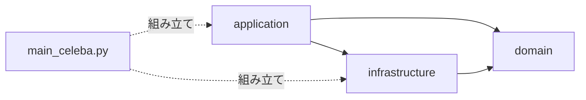

# src

ソースコードは 3 つの層に分けています。
どこに何を書くか迷ったときは、**「その知識が失われて困るのは誰か」** で判断してください。

| 層 | 置くもの | 依存してよい層 |
|---|---|---|
| `domain/` | 解こうとしている問題そのものの定義。タスクの種類、ラベルの決め方 | なし |
| `application/` | その問題をどう解くか。モデル構造、学習の進め方、評価方法 | `infrastructure` / `domain` |
| `infrastructure/` | 外の世界とのやり取り。ファイル読み書き、設定ファイル、データセットの所在 | `domain` |

依存の向きは **`application` → `infrastructure` → `domain`** の一方向です。

- `infrastructure` が `application` を import してはいけません
- `domain` は他のどの層も import しません

`infrastructure` は「どう書き出すか」「どう読み込むか」という手段だけを提供し、
「何を書き出すか」は `application` が決めます。



## ディレクトリの中身

```text
src/
├── main_celeba.py                   <- 組み立て役。どの部品を使うかをここだけで決める
├── custom_utils/                    <- ログ・パス・乱数シードなど、層に属さない小道具
├── domain/
│   ├── tasks.py                     <- ClassificationTask / TaskSuite
│   └── celeba/labels.py             <- 属性からラベルを導く規則 (LabelRule)
├── application/
│   ├── models/                      <- ネットワーク構造
│   ├── preprocessing/               <- 画像の前処理と逆変換
│   ├── training/                    <- 学習の進め方
│   │   ├── loop.py                  <- 進行役。何を残すかは知らない
│   │   ├── phases.py                <- 学習/検証の 1 巡
│   │   ├── stopping.py              <- 打ち切り方針
│   │   └── observers/               <- 何を記録・出力するかを決める
│   │       ├── protocol.py          <- 契約 (RunObserver) と受け渡す報告
│   │       ├── recording.py         <- loss.csv / metrics.csv
│   │       └── artifacts.py         <- 重み・混同行列・Grad-CAM
│   └── evaluation/                  <- 評価指標と Grad-CAM
└── infrastructure/
    ├── config_loader.py             <- YAML から設定オブジェクトへ
    ├── construct_dataset/           <- CelebA の読み込みと DataLoader 化
    └── outputs/
        ├── workspace.py             <- 実行ごとの出力先ディレクトリ
        └── table.py / model.py / figure.py   <- CSV・重み・図の書き出し方
```

## 出力を増やしたいとき

学習ループ (`application/training/loop.py`) は、起きた出来事を観測者に伝えるだけで
自分では何も書き出しません。出力を増やす場合は次の 2 手順で済み、ループには手を入れません。

1. `application/training/observers/` に `RunObserver` を実装したクラスを足す
2. `main_celeba.py` の `_assemble_observers` の並びに加える

書き出し方そのもの (CSV・画像・重み) は `infrastructure/outputs/` の関数を使ってください。
観測者が `open` や `savefig` を直接呼ぶと、出力先の変更が各所に散らばります。

## 別のデータセットを扱いたいとき

`domain/celeba/` と `infrastructure/construct_dataset/` が CelebA 固有の部分です。
この 2 つを差し替えれば、`application/` 以下はそのまま使えます。
